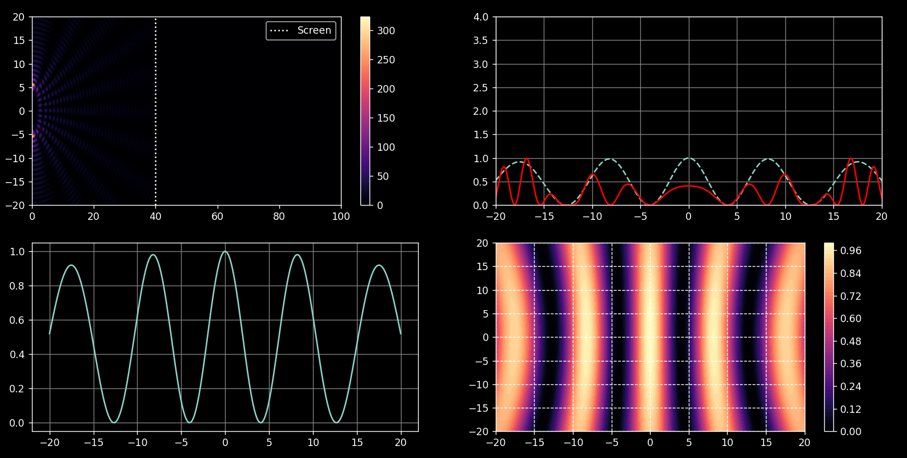
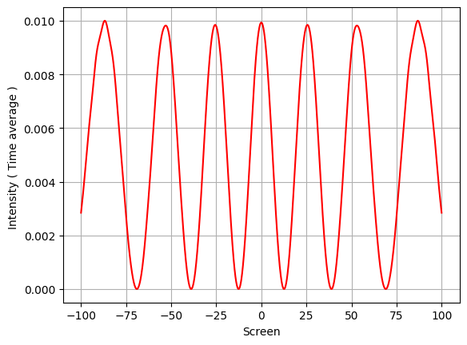
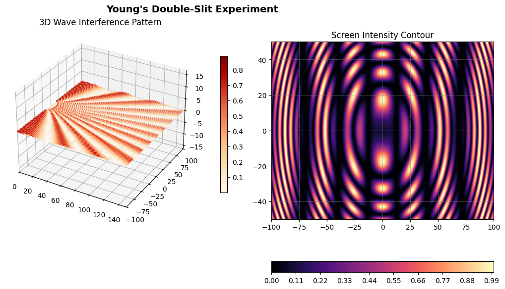
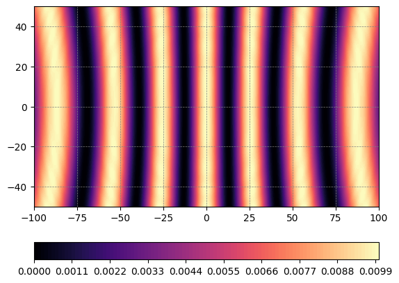

# Electromagnetism Lab

Computational exploration of Electromagnetism with a current focus on Young's Double Slit Experiment (YDSE).

## 🎯 Goal

To explore electromagnetism beyond textbook formulas by building simulations, visualizing results, and developing intuitive understanding of physical concepts.

## Main Work

[YDSE_3D.ipynb](YDSE/simulations/YDSE_3D.ipynb)

## Project Structure

- [YDSE/simulations/](YDSE/simulations/)
- [YDSE/results/](YDSE/results/)
- [YDSE/highlight_work/](YDSE/highlight_work/)
- [YDSE/theory/](YDSE/theory/)
- [Electric_Field/](Electric_Field/)

## Conceptual Insight

[ydse_intuition.md](YDSE/highlight_work/ydse_intuition.md)

## Results

### Basic Pattern

### Intensity at z = 0

### Intensity Snapshot

### Time-Averaged Intensity

## Simulations

- [ydse_3d_simulation.py](YDSE/simulations/ydse_3d_simulation.py)
- [ydse_intensity_contour.py](YDSE/simulations/ydse_intensity_contour.py)

## Theory

- [YDSE/theory/](YDSE/theory/)
- `YDSE/theory/ydse_formal.md` does not exist yet.
